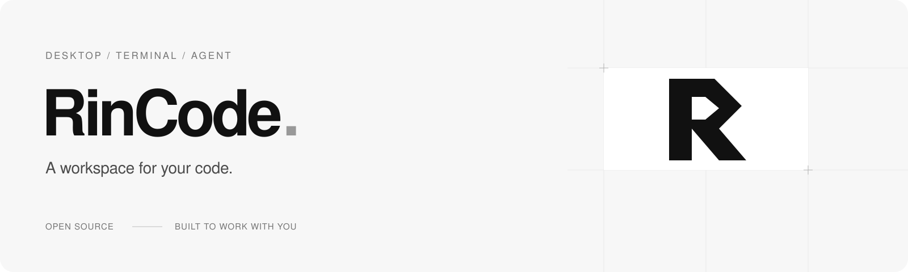

**在项目里读代码、改文件、运行测试。** RinCode 是通过自然语言协作的编码 Agent，提供黑白桌面界面与终端界面，让任务、工具执行和可继续的对话留在同一处。

[快速开始](#快速开始) · [桌面运行](#桌面运行) · [开发与验证](#开发与验证) · [上游与许可](#上游与许可)


<sub>当前桌面界面，使用独立演示项目与示例会话。原创标识与图标见 <a href="docs/brand/README.md">品牌资产</a>。</sub>

<details>
<summary>更多界面：开始任务、选择模型、搜索与归档</summary>

<p>
  
  
</p>
<p>
  
  
</p>

</details>

## 可以做什么

- **在真实项目中完成任务**：检索代码、编辑文件、执行命令与测试，根据工具结果继续处理；支持 Web、MCP 工具和子 Agent 协作。
- **看清执行过程**：流式回复、可展开的思考与工具记录、随时停止生成；代码块与 Markdown 表格直接在对话中阅读。
- **接着之前的工作**：按项目管理已发送并保存的对话，搜索标题与正文，归档后随时恢复。移除项目入口会保留本地文件与历史。
- **使用自己的模型服务**：从已配置提供商的候选目录切换模型。桌面选择由当前项目的所有对话共用，重新连接后恢复配置默认。

## 快速开始

运行时使用 Python 3.12。macOS / Linux 在终端中执行：

```bash
git clone https://github.com/2568xt/RinCode.git
cd RinCode
./install.sh
```

安装器会准备缺少的 `uv` 与 TUI 所需的 Node.js 22，构建终端界面，并注册 `rincode` 命令。Windows 在源码目录使用 PowerShell 执行 `./install.ps1`。

安装完成后重新打开终端，进入要处理的项目目录，按向导配置模型服务与 API Key：

```bash
cd /path/to/your-project
rincode onboard --skip-memory
rincode
```

`rincode` 打开交互式终端界面；也可以用 `rincode run -m "阅读这个项目，解释任务执行流程"` 执行一次任务。首次引导会发起模型请求。当前不附带外部 Memory 实现，因此首次配置使用 `--skip-memory`；会话保存仍可正常使用。更多设置见 [首次使用指南](docs/onboarding/README.zh-CN.md)。

## 桌面运行

桌面版当前面向 macOS。准备好可在终端中使用的 Node.js 22.12+ 与 `npm`，完成上述模型配置后，在 **RinCode 源码根目录**运行：

```bash
uv sync --python 3.12
npm --prefix ui-desktop ci
npm --prefix ui-desktop run build
npm --prefix ui-desktop start
```

`uv sync` 创建桌面后端使用的 `.venv`；全局命令安装不会创建这个环境。打开应用后，点击“添加本地项目”选择工作目录，发送第一条消息即可开始。

可以构建本机 `.app`，它会记录源码路径，并使用本机 Python 环境；目前没有将 Python 与后端源码一起封装成可跨机独立安装的应用包。打包方法、模型范围及会话管理说明见 [桌面文档](ui-desktop/README.md)。

## 开发与验证

在源码根目录准备开发依赖，再运行相关检查：

```bash
uv sync --extra dev
uv run pytest -q tests/test_spine_scheduler_lane.py tests/test_maintenance_acceptance.py

# 桌面检查，需先完成上面的 npm ci
npm --prefix ui-desktop run type-check
npm --prefix ui-desktop test
uv run pytest -q tests/test_desktop_server.py tests/test_desktop_models.py tests/test_desktop_history.py

# 不调用模型的评估冒烟检查
uv run python -m benchmarks.rincodebench --mode smoke
```

RinBench 根据文件产物、工具回执和回归结果验收任务，并记录用量与耗时。评测方法见 [RinBench 文档](benchmarks/rincodebench/README.md)；桌面真实模型验证见 [桌面文档](ui-desktop/README.md#开发验证)。真实模型任务与验证会使用你配置的服务，并可能产生 API 费用。

## 上游与许可

RinCode 基于 [htxoffical 维护的上游运行时](https://gitee.com/htxoffical/pico-harness)继续开发，由 [2568xt](https://github.com/2568xt)维护本仓库。项目与上游运行时采用 [Apache-2.0](LICENSE)，保留原有作者署名与版权声明。

基础运行时包含 [nanobot](https://github.com/HKUDS/nanobot) 的 MIT 许可代码；终端界面来自 [hermes-agent](https://github.com/NousResearch/hermes-agent)，包含其 `@hermes/ink` 及上游 [Ink](https://github.com/vadimdemedes/ink)，相应部分保留 MIT 许可。PinchBench 任务与夹具也保留原有 MIT 许可。完整来源、适用范围及许可文本见 [NOTICES.md](NOTICES.md) 和 [LICENSES](LICENSES/)。
