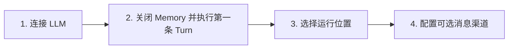

# RinCode 首次使用

这份指南只完成一个闭环：在你选定的 Git 仓库里安装 RinCode、配置 Provider，并收到
第一条真实回复。

## 1. 准备环境

RinCode 需要 Python 3.12。原生 TUI 使用 Node.js 22；系统缺少合适版本时，安装器
会下载私有 Node Runtime。

RinCode 当前是未发布的本地分支。请在这份 RinCode 源码目录执行：

```bash
./install.sh
```

Windows PowerShell 在同一源码目录执行：

```powershell
.\install.ps1
```

安装器会构建缺失的 TUI 产物，并安装本地源码和消息渠道依赖。安装器没有预设
RinCode 发布地址；独立使用安装脚本时，必须设置 `RINCODE_WHEEL_URL`，指向可信的
`rincode_harness-*.whl` URL 或本地 wheel 路径。私有 Gitee wheel 可通过
`RINCODE_GITEE_TOKEN` 鉴权。

不要从来路不明的地址安装 wheel，也不要把 Token 写进仓库、命令截图或日志。

## 2. 在目标仓库中启动向导

先进入 RinCode 实际要工作的 Git 仓库：

```bash
cd /path/to/your-project
rincode onboard --skip-memory
```

当前发布不包含外部 Memory 实现，因此首次配置必须显式使用 `--skip-memory`。
向导仍然保留完整的四步路径：



### 第一步：连接 Provider

选择 Provider，输入 API Key，再确认默认模型。交互式向导是首选的密钥输入路径。
Provider 预检失败时，不要仅凭配置文件已经写入就继续宣称连接成功。

### 第二步：收到第一条真实回复

`--skip-memory` 会写入 `memory.backend = null`，Local Skills、Session 和 Context
仍然可以正常工作。随后向导通过完整 Runtime 发出一条请求。只有看到 `Agent:` 回复，
首次使用闭环才算完成。

这一步可能产生 Provider 费用。使用 `--skip-test` 可以跳过，但跳过后只能说明配置
已经写入，不能说明模型调用成功。

### 第三步：选择运行位置

根据当前环境选择直接在 Host 运行，或者使用已经准备好的 Sandbox。向导完成后，
`rincode doctor --json` 会显示当前选择。

### 第四步：配置消息渠道

可以先跳过渠道，直接使用 CLI 或 TUI；也可以继续配置飞书等渠道。渠道配置完成后，
仍需启动对应 Workspace 的 Gateway，并进行一次真实入站消息测试。

## 3. 非交互配置

自动化场景可以使用：

```bash
rincode onboard \
  --non-interactive \
  --provider openai \
  --api-key "$OPENAI_API_KEY" \
  --skip-memory \
  --skip-channel \
  --yes
```

命令行参数可能被 Shell 历史或本机进程列表读取。只有用户明确授权非交互密钥处理时，
安装 Agent 才能使用 `--api-key`。

已有配置时，`--yes` 允许复用；`--reset` 会重新进入配置流程。不要在不清楚现有配置
归属时自动加上 `--reset`。

## 4. 验收

先检查静态状态：

```bash
rincode --version
rincode plugins
rincode channels list
rincode doctor --json
```

验收结果应满足：

- `rincode --version` 能返回已安装版本。
- `rincode doctor --json` 输出合法 JSON。
- Memory 明确处于关闭状态，不应选择一个未安装的 Backend。
- 输出中没有 API Key、App Secret 或 Token。

用户允许一次真实 Provider 调用时，再运行：

```bash
rincode doctor --probe
rincode run -m "用三句话说明这个仓库做什么"
```

`doctor --probe` 与 `rincode run` 都真实经过 Provider。只执行其中一个即可证明模型回复；
两者同时运行会产生两次调用。

## 5. 启动方式

```bash
rincode
rincode run -m "总结当前仓库"
rincode gateway --workspace "$PWD" --verbose
```

- `rincode` 启动原生 TUI。
- `rincode run` 执行一次 CLI Turn。
- `rincode gateway` 为当前 Workspace 服务已经启用的消息渠道。

## 6. 继续配置

- [飞书机器人](feishu.zh-CN.md)
- [Memory 发布边界](memory.zh-CN.md)
- [故障排查](troubleshooting.md)
- [给安装 Agent 的操作契约](agent-install.md)
- [Onboarding 媒体验收清单](media-manifest.md)
