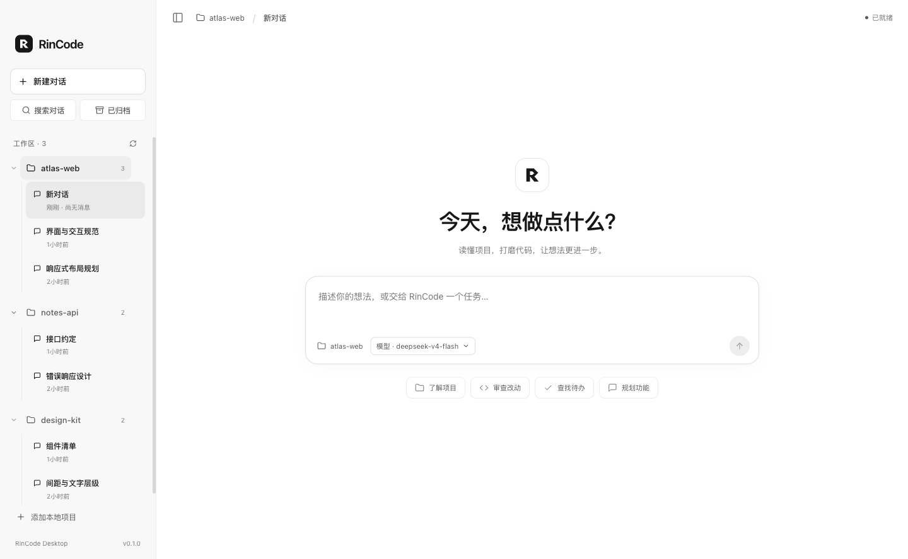
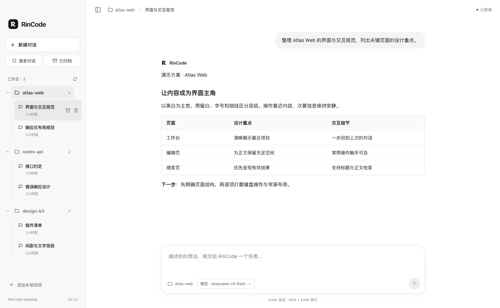
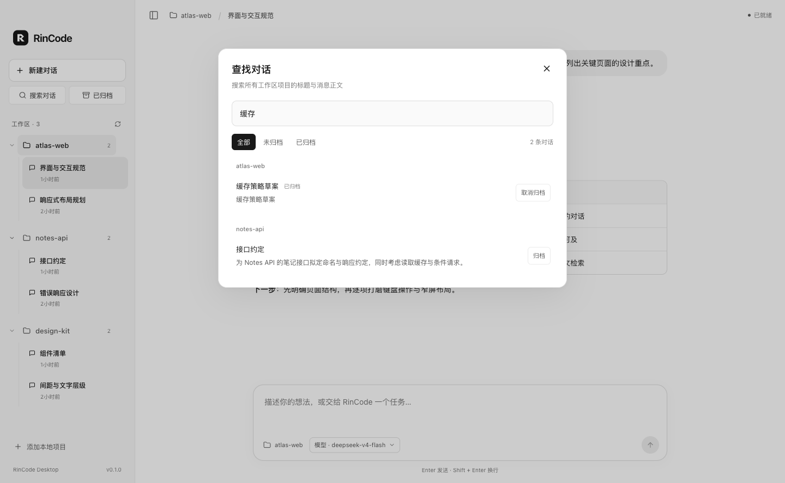
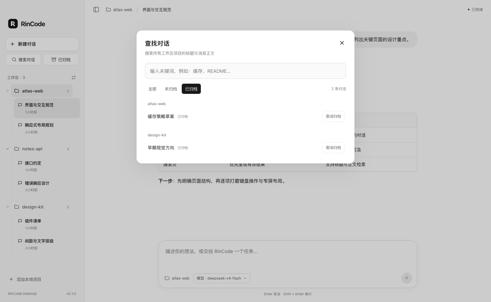
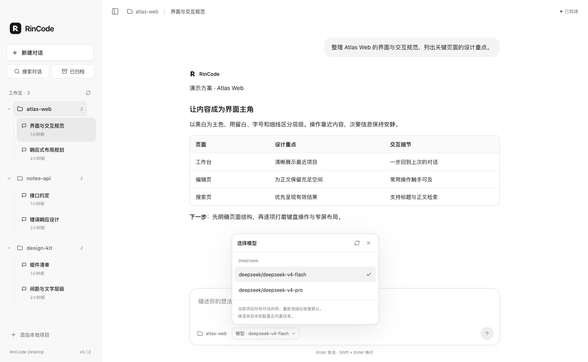

# RinCode Desktop

RinCode 的 macOS 桌面界面：从本地项目开始，在同一窗口中发送任务、查看工具执行、找回历史对话。界面以黑白和中性灰为主，保留清晰的项目树与紧凑的输入区。



<sub>本文截图来自当前实现，使用独立演示项目与示例会话。</sub>

## 从源码运行

需要 Python 3.12、[uv](https://docs.astral.sh/uv/) 和可在当前终端中使用的 Node.js 22.12+、`npm`。以下命令均在 **RinCode 源码根目录**执行：

```bash
uv sync --python 3.12
npm --prefix ui-desktop ci
npm --prefix ui-desktop run build
npm --prefix ui-desktop start
```

`uv sync` 会创建并安装仓库的 `.venv`。桌面后端优先使用 `RINCODE_PYTHON` 指定的解释器，其次使用源码目录中的 `.venv`，最后尝试 `python3`。通过 `install.sh` 安装全局 `rincode` 命令不会创建仓库 `.venv`。首次 `npm ci` 会下载 Electron 运行时。

若尚未配置模型服务，先运行 `uv run rincode onboard --skip-memory`，再启动桌面应用；向导会进行一次真实模型请求。配置方法见 [首次使用指南](../docs/onboarding/README.zh-CN.md)。

## 项目与对话

点击“添加本地项目”选择工作目录，发送第一条消息即可创建对话。生成过程中可以点击停止按钮或按 Esc 取消；中文输入法选词时按回车不会发送消息。

| 操作 | 行为 |
| --- | --- |
| 切换项目或对话 | 侧栏按项目列出已发送并保存的对话；点击旧对话可以继续。空白的新对话不会作为历史保存。 |
| 搜索对话 | 搜索本机所有已添加项目的会话标题与消息正文，支持中文子串、忽略大小写和归档筛选；点击结果打开原对话。 |
| 归档与恢复 | 对话行的归档按钮将已保存对话移入“已归档”；可在该入口恢复并继续对话，重启后仍保留归档状态。 |
| 移除项目 | 确认后移除应用中的项目入口，保留磁盘文件与历史；重新添加同一目录可以找回。 |
| 删除对话 | 确认后删除所选对话；需要稍后继续的对话可以先归档。 |

回复支持代码块、链接与 Markdown 表格；表格支持列对齐、行内代码和转义竖线，宽表格可以横向滚动。工具记录与思考内容可展开查看。

<details>
<summary>查看对话、搜索与归档界面</summary>



<p>
  
  
</p>

</details>

## 切换模型

输入框底部的“模型”按钮显示当前运行模型，打开后列出已配置提供商的候选。候选来自本机配置及内置目录，列在菜单中不代表提供商账户一定可用。

选择应用于**当前项目正在运行的后端**，该项目所有对话共用；新建或恢复对话不会重置，重新连接项目或重启应用后恢复配置默认，不修改全局配置。任务执行中不能切换；切换期间暂时禁用发送与项目切换，失败时保留原模型。

<details>
<summary>查看模型选择器</summary>



</details>

## 构建本机 macOS 应用

完成依赖安装后运行：

```bash
npm --prefix ui-desktop run package:mac
```

脚本会先构建界面，再按当前 Node.js 架构生成 `ui-desktop/out/RinCode-darwin-arm64/RinCode.app` 或 `RinCode-darwin-x64/RinCode.app`。可在 Finder 中双击打开。

当前应用包记录构建时的源码路径（`sourceRoot`），启动时仍从该位置运行 Python 后端，并使用本机 Python 环境。请保留源码目录和已安装的依赖；移动源码目录后重新打包。应用包没有内置 Python 与完整后端源码，不能只复制 `.app` 就在另一台电脑独立运行。

## 开发验证

安装开发依赖后，运行不需要模型请求的检查：

```bash
uv sync --extra dev
npm --prefix ui-desktop run type-check
npm --prefix ui-desktop test
uv run pytest -q tests/test_desktop_server.py tests/test_desktop_models.py tests/test_desktop_history.py
```

下列可选验证会使用已配置的真实模型并可能产生 API 费用：

```bash
# 真实 Electron、Python、会话与工具调用；在临时项目中运行
npm --prefix ui-desktop run test:e2e

# 当前提供商需有另一个已配置候选；验证切换、回复与全局配置不变
npm --prefix ui-desktop run test:models
```

桌面 E2E 的截图与结果写入 `ui-desktop/out/verification/`。实现与验收记录见 [桌面验证记录](../docs/desktop/verification.md)。

## 运行边界

桌面界面连接本机 Python 后端，项目目录决定该后端的工作目录；这本身不构成文件系统沙箱。删除对话、移除项目的确认，以及 Agent 的交互提问各自有明确用途，不能据此认为所有危险工具执行都会经过通用审批。

上游署名与各层许可见 [项目说明](../README.md#上游与许可) 和 [NOTICES.md](../NOTICES.md)。
